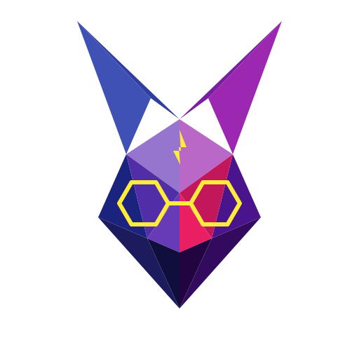

# 🐇 Projekt Słówka Remastered

An advanced, feature-rich **Spaced Repetition Flashcard System** built for modern desktops. Leverage custom schedules, related card groups, rich text styles, and image support to study and retain information efficiently—all powered by an elegant, responsive, offline-first architecture.

<p align="center">
  
</p>

<p align="center">
  <a href="https://dotnet.microsoft.com/">
    
  </a>
  <a href="https://avaloniaui.net/">
    
  </a>
  <a href="https://reactiveui.net/">
    
  </a>
  <a href="https://sqlite.org/">
    
  </a>
</p>

<p align="center">
  <a href="https://github.com/features/copilot">
    
  </a>
</p>

---

## ⚡ Built entirely via Vibe Coding!

> [!IMPORTANT]
> **This application is 100% Vibe Coded.** 
> No human developer directly wrote the lines of C# or AXAML code in this repository. Instead, it was crafted purely by steering AI coding agents (Antigravity by Google DeepMind) through high-level vision, architectural intent, iterative feedback, and architectural constraints. 
> 
> The development process relied on pure "vibes" and advanced AI orchestration—defining requirements, resolving errors, building tests, and refining the interface dynamically without touching a compiler directly. Welcome to the future of software development!

---

## 🌟 Key Features

### 📅 Advanced Spaced Repetition (SRS)
* **Dual Review Modes**: Supports both standard one-sided reviews (Q→A) and bidirectional reviews (first Q→A, then A→Q) to ensure deep memory retention.
* **Smart Intervals**: Cards progress through standard intervals (`1 → 3 → 10 → 30` days).
* **Failure Statistics & Hard Mode**: When cards become problematic, the system automatically pivots to a more granular hard mode (`1 → 3 → 6 → 10 → 20 → 30` days) to prevent relapse.
* **Auto-Archiving**: Reaching the maximum 30-day interval and passing it automatically archives the question. Cards with excessive consecutive failures (`statistics.failures >= 3`) are also archived for later review.

### 🧠 Related Question Groups (`groupId`)
* **Cohesive Learning**: Link questions together into a single group to review them sequentially in a single session.
* **Collective Success/Failure**: The group advances only when *all* questions are correctly answered. A single failure on any group item drops the interval for the entire group back to 1 day, keeping your understanding synchronized.

### 🚀 Risk-Free Training Mode
* **Consecutive Review**: Study without affecting your active SRS intervals.
* **Dynamic Training Queues**: Select from tomorrow's reviews, problematic cards, specific categories, or multiple selected categories combined.
* **State-Based Queue Progression**: Incorrect answers push cards 3 positions back in the training queue; correct answers advance their learning state before final mastery.

### 🖼️ Rich Media and Image Clipboard Integration
* **Clipboard Support**: Paste screenshots directly from your system clipboard into your flashcards.
* **Automatic Storage**: Attached images are copied to local media directories, indexed by database ID, and rendered cleanly in views.

### 📄 Export to LaTeX
* **Structured Export**: Turn your categories into beautifully structured LaTeX projects (`.tex`) with dedicated assets.
* **Automatic Hierarchy**: Maps Categories to `\title`, Topics to `\section`, and Sections to `\subsection`.
* **Code & Formatting Preservation**: Supports custom syntax wrappers (`*sc` ... `*ec`) to render code blocks correctly in both the UI and LaTeX documents.

### 🔒 Offline-First & Customizable
* **Local Database**: Powered by SQLite for zero-latency, private, offline-first study.
* **Configurable Storage & Backups**: Define custom paths for databases, photos, and automated external folder backups (e.g. OneDrive) inside `appsettings.json`.

---

## 🛠️ Architecture & Tech Stack

Following modern clean-code architecture, the codebase is structured around a feature-oriented layout:

* **Core**: Services, Models, Base classes, and the strongly-typed Option pattern configuration.
* **Features**: Cohesive feature folders (UI, Domain, Resources) registering routes via modules.
* **Infrastructure**: Entity Framework Core DbContext, repository contracts implementations, and Dependency Injection configuration via `Microsoft.Extensions.DependencyInjection`.
* **Shared**: Global UI styles, custom controls, and centralized resources (`GlobalStrings.resx`).

---

## 🚀 Getting Started

### Prerequisites
* **.NET 10 SDK** (matching targeted framework `net10.0`)
* SQLite (automatically managed by EF Core)

### Run the Application
From the repository root (`project/`), run:
```bash
dotnet run
```
Or from the workspace root:
```bash
dotnet run --project project/ProjektSlowkaRemasterd.csproj
```

### Run Tests
To run unit and behavior tests:
```bash
dotnet test
```

---

## 🎨 Theme & Design
The app is styled with Avalonia's `FluentTheme` and customized dark mode palettes:
* **Primary Accent**: Custom deep blue (`#ff0073cf`)
* **Fonts**: Modern typography (Inter, System Default UI)
* **Icons**: `Material.Icons.Avalonia` & `FluentIcons.Avalonia`
